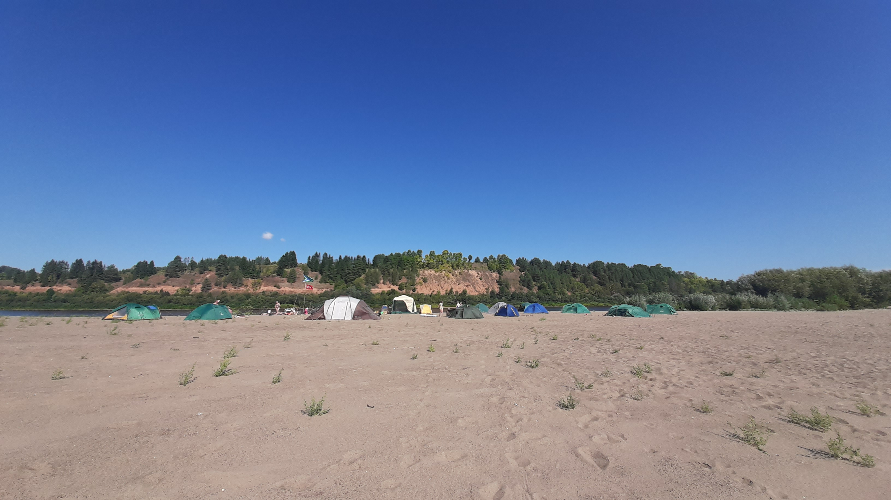

# Зыков Константин Валерьевич #

 
4 мая 1982 г. в г.Киров (Кировская обл.). Образование - высшее, ВятГУ, специальность - инженер-электрик.
 

1. Програмирование на JAVA
2. Работа с GIT
3. Программирование на kotlin
4. Android

